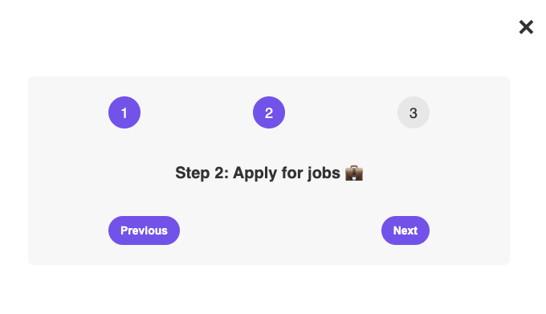

# Step Message

A small React app for practicing state and event handling. It presents a three-step learning flow that visitors can navigate with **Previous** and **Next** controls.

## Preview



## Features

- Tracks the current step with React's `useState` hook
- Prevents navigation before step 1 or after step 3
- Updates the active step indicator and message dynamically
- Lets the user show or hide the step panel

## Concepts practiced

- State with `useState`
- Event handlers with `onClick`
- Conditional rendering
- Updating state from its previous value
- Conditional CSS classes and inline styles

## Built with

- React 19
- Create React App (`react-scripts`)
- CSS

## Getting started

From this directory, install dependencies and run the development server:

```bash
npm install
npm start
```

The app opens at [http://localhost:3000](http://localhost:3000).

## Available scripts

| Command | Description |
| --- | --- |
| `npm start` | Runs the app in development mode. |
| `npm test` | Starts the interactive test runner. |
| `npm run build` | Creates an optimized production build. |

## Project structure

```text
State & Events/
├── public/
│   └── index.html
└── src/
    ├── App.js       # Step-flow component and state logic
    ├── index.css    # Application styles
    └── index.js     # React entry point
```
