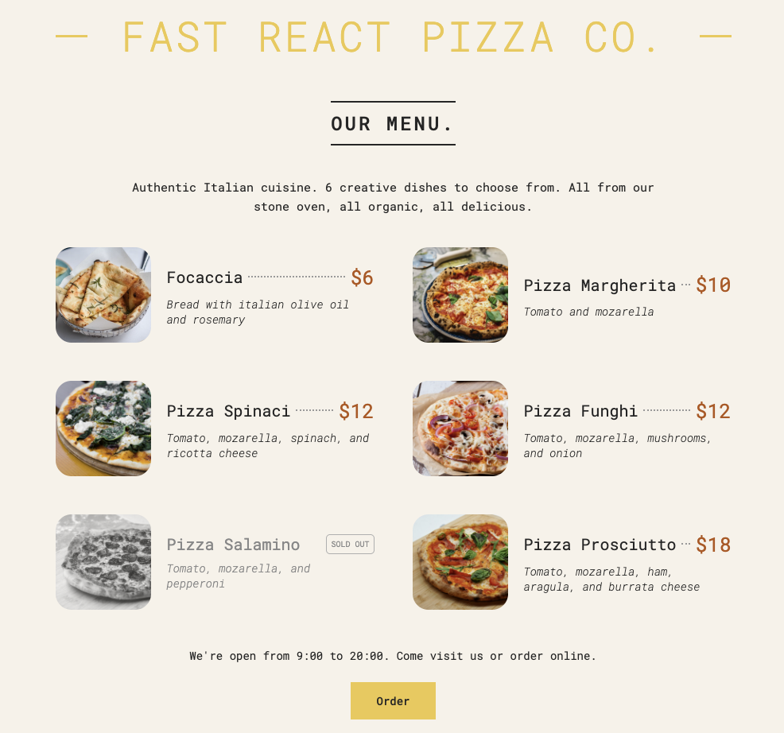

# Fast React Pizza Co.

A small React menu page built as part of the React Learning Lab. It renders an Italian pizza menu from local data and demonstrates component composition, props, conditional rendering, and list rendering.

## Preview



## Features

- Displays six menu items with photos, descriptions, and prices
- Uses reusable `Header`, `Menu`, `Pizza`, and `Footer` components
- Maps menu data into pizza cards with stable React keys
- Highlights unavailable items with a grayscale image and **Sold Out** label
- Shows a fallback message when the menu has no items

## Built with

- React 19
- Create React App (`react-scripts`)
- CSS Grid and Flexbox

## Getting started

From this directory, install dependencies and start the development server:

```bash
npm install
npm start
```

The app opens at [http://localhost:3000](http://localhost:3000).

## Available scripts

| Command         | Description                            |
| --------------- | -------------------------------------- |
| `npm start`     | Runs the app in development mode.      |
| `npm test`      | Starts the interactive test runner.    |
| `npm run build` | Creates an optimized production build. |

## Project structure

```text
pizza-menu/
├── public/
│   └── pizzas/       # Menu-item images
└── src/
    ├── index.css     # Page styles
    └── index.js      # Components and menu data
```

## Learning focus

This project practices JSX, functional components, passing props, rendering arrays with `map`, and conditional class names/content in React.
